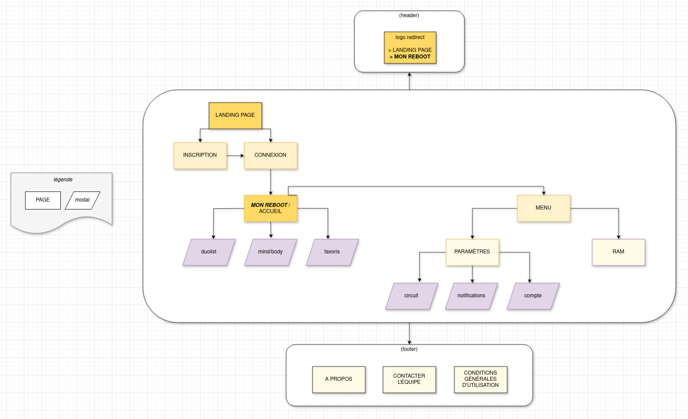

# **MOTHERBOARD**
## **Cahier des charges** 


### **PRÉSENTATION EN FRANÇAIS**
Motherboard est un espace en ligne pour les mères. Un espace où elles peuvent prendre soin de l'essentiel : leur cerveau et leur corps.
Comme le circuit imprimé qui structure les ordinateurs, une mère a un rôle essentiel dans son environnement familial et amical. Elle permet la communication entre les différentes entités qui compose son environnement. Elle a donc besoin, pour maintenir sa concentration et son energie de son propre espace.
Une application entre to-do list, méditation et fitness pour les mamans qui ont peu de temps et qui veulent créer de l'espace dans leur corps et leur tête.
Proposition chaque jour de :
- 1 vidéo pour faire du sport (yoga, HIIT, pilate ou musculation)
- 1 audio/vidéo de méditation guidée
- Remplir la duo list du jour -> 1 élément professionnel, 1 élément perso/les proches

Chaque activité ne fait qu'entre 2 et 15 minutes
Quand on ouvre l'application :
+ combien de temps pouvez vous consacrer pour chaque activité aujourd'hui ?
    + choix multiple : 2 minutes, 6 minutes, 10 minutes,


Communauté et sororité 
Minimaliste --> pas besoin de surcharger des journées et cerveaux qui le sont déjà

Inspirations : FitOn x Todoist x Fabulous x plugin Bonjourr x Down Dog

Peu d'information de profil demandé
- Prénom
- Pseudo
- Email
- Date de naissance
- Ville

#### **Description brève**

### **PRÉSENTATION EN ANGLAIS** 

#### **Description brève**


### **RÔLES**
Pour cette application, tous les rôles (développeuse, porteuse de projet, product owner) sont portés par Charlène Hounsou-Guédé.
Référent technique --> équipe du 24ème

### **CIBLE**
- Femmes
- Mères
- Avec ou sans emploi
- Toute tranche d'age ave ciblage spécifique pour les millenials 35-45 ans
- En particulier les femmes qui n'ont pas accès à des equipements sportifs par faute de moyens financiers et/ou de proximité 
- Interessée par le bien être
- On envie de se dépenser sans se mettre la pression
- Overbookés et ayant beaucoup de responsabilités pro et perso


### **FONCTIONNALITÉS** 
#### **MVP**

- Se connecter/se déconnecter
- Créer un compte 
- Choisir une heure de notification quotidienne/hebdo 
- Arrêter les notifications
- Faire sa duo liste quotidienne (to list pro + perso : 1 élément pour chaque)
- Avoir accès à une méditation quotidienne différente de moins de 10 minutes (audio)
- Avoir accès à une activité sportive intense différente sans accessoire de moins de 10 minutes (vidéo)
- Avoir les statistiques d'activités (nombre de minutes et nombre d'activités)
- Télécharger ses données personnelles (RGPD)

#### **Evolutions possible**
- Gamification --> encouragement quand action faite + plus longues semaines d'actions
- Échanger avec d'autres mères / forum
- Reporter les tâches non faites dans une liste à partir de laquelle on peut choisir sur les autres jours
- Avoir une proposition de tâches à faire
- Se connecter à d'autres mères
- Choisir le temps disponible quotidiennement
- Enregistrer mes vidéos et audio favoris
- Avoir une citation motivante par jour 
- Un minuteur pomodoro pour avancer sur ses projets
- Un espace de rédaction des objectifs annuels à sa date d'anniversaire (duo goal : pro/perso)
- Avoir accès à des recettes de cuisine rapides
- Voir les activités sportives / méditation les plus faites
- Un article positif par jour
- L'astuce minimaliste du jour
- Axe sobriété (alcohol, cigarette, sucre, réseaux sociaux)
- Tri des activités favorites par minutage
- Choisir entre un thème sombre ou clair
- Avoir accès à une FAQ
- Les utilisatrices peuvent proposer des sources (licences libres ?) de fitness/méditation
- Gérer l'admin familial


### **LISTE DES TECHNOLOGIES**
**Backend**
- PHP
- Symfony pour le framework
- Templating avec Twig 3
- NoSQL avec une base de données orientée document en format JSON
- MongoDB pour la gestion de la base de données
- Peertube API (open source) : https://framacolibri.org/t/is-it-possible-to-get-random-videos-via-api/17987

- Méthode ```password_hash()``` pour sécuriser les mots de passe
- https://phpdelusions.net/pdo pour éviter les CSRF injection


#### Pourquoi PHP
*Source : https://minifi.ca/MR2V_*
+ PHP est toujours un langage populaire (près de 50% de part de marché en 2023)
+ Il est adapotable à tout type de projet, des plus simples aux plus complexes.
+ Flexible car n'impose pas de style et large ecosysteme de framework
+ Utilisable avec différents type de bases de données
+ Fonctionne sur un large spectre de serveurs (Apache, Nginx, etc.) et de plateformes (Linux, Mac, Windows, Unix)
+ Une pléthore de fonctions pour accompagner à la sécurisation de l'application contre le cross-site scripting (XSS), les injections SQL , le cross-site request forgery (CSRF) et l'execution de code à distance (remote code execution - RCE). De plus, il est possible de faire de l'encryptage, du hashing, du hashing de mots de passe, d'ajouter des certificats SSL/TLS certificates et l'authentification HTTP.
+ Fun et intuitif à utiliser

#### Pourquoi Symfony
*Sources :*
- *https://minifi.ca/w7ZZg*
- *https://minifi.ca/L-08C*
+ Superbe documentation
+ Syntaxe fluide, simple et concise de Twig
+ Plus souple si on s'éloigne du paradigme MVC


#### Pourquoi NoSql
*Source :*
- *https://minifi.ca/EXLXp*
+ Plus naturel et flexible
+ Possibilité de recherche textuelle
+ Archivage en ligne aisés

**Frontend**
- Html/CSS
- Bootstrap 5


#### Pourquoi Bootstrap
+ Disponibilité de plusieurs composants UI
+ Adaptabilité responsive simple
+ Fait gagner du temps

**Outils**
- GIT et github 
- VsCodium 
- Terminal linux
- NextCloud Deck pour la gestion de projet : https://jeancloude.24eme.fr/index.php/apps/deck/board/4
- Carnet de bord en markdown

### **NAVIGATEURS COMPATIBLES**
Motherboard est prévue pour être fonctionnelle sur toutes les dernières versions des navigateurs les plus utilisés : Google Chrome, Firefox, Edge, Safari


### **USER STORIES**

*En tant qu'utilisatrice non enregistrée ou non connectée*

| Sur la page  |   J'ai besoin de                 |    Afin de/d'                       | Domaine         |
|:------------:|:--------------------------------:|:-----------------------------------:|:---------------:|
|Global/contact|Contacter l'équipe du site        |Demander des informations            |Communication    |
|Accueil       |Créer un compte                   |Accéder à toutes les fonctionnalités |Gestion          |


*En tant qu'utilisatrice enregistrée non connectée*

| Sur la page              |   J'ai besoin de                                |    Afin de/d'                                | Domaine         |
|:------------------------:|:-----------------------------------------------:|:--------------------------------------------:|:---------------:|
|Accueil                   |Pouvoir me connecter                             |Accéder à mon profil                          |Authentification |
|Accueil                   |Réinitialiser mon mot de passe oublié            |Accéder à mon profil                          |Authentification |
|Global/contact            |Contacter l'équipe du site                       |Demander des informations                     |Communication    |


*En tant qu'utilisatrice connectée*

| Sur la page              |   J'ai besoin de                                |    Afin de/d'                                | Domaine         |
|:------------------------:|:-----------------------------------------------:|:--------------------------------------------:|:---------------:|
|Global/contact            |Contacter l'équipe du site                       |Demander des informations                     |Communication    |
|Paramètres/compte         |Modifier mes informations personnelles           |Avoir du contenu personnalisé                 |Gestion          |
|Paramètres/compte         |Me déconnecter du site                           |Préserver mes apps privée sur mon téléphone   |Authentification |
|Paramètres/compte         |Télécharger mes données personnels               |Accéder à mes droits RGPD                     |Gestion          |
|Paramètres/compte         |Supprimer mon compte                             |Arrêter définitvement mon utilisation         |Gestion          |
|Paramètres/circuit        |Choisir les types d'activités sportives          |Etre motivée par des acivités qui me plaisent |Personnalisation |
|Paramètres/notifications  |Définir l'horaire de notification quotidienne    |Avoir des rappels adaptés à mon planning      |Personnalisation |
|Paramètres/notifications  |Arrêter les notifications                        |Faire des pauses numérique                    |Personnalisation |
|Mon Reboot/duolist        |Remplir mes 2 tâches pro/perso du jour           |M'organiser et libérer de l'espace mental     |Utilisation      |
|Mon Reboot/duolist        |Valider mes tâches et être encouragée            |Me sentir capable, efficace et satisfaite     |Utilisation      |
|Mon Reboot/duolist        |Reporter les tâches non faites au lendemain      |Libérer de l'espace et ne pas culpabiliser    |Utilisation      |
|Mon Reboot/duolist        |Supprimer une tâche                              |Me sentir capable, efficace et satisfaite     |Utilisation      |
|Mon Reboot/mindbody       |Lancer une vidéo d'entrainement sportif          |Entretenir ma santé physique                  |Utilisation      |
|Mon Reboot/mindbody       |Lancer un audio de méditation guidée             |Entretenir ma santé mentale                   |Utilisation      |
|RAM                       |Avoir le nombre d'activités faites               |M'encourager à continuer                      |Statistiques     |
|RAM                       |Avoir le nombre de minutes faites par activités  |M'encourager à continuer                      |Statistiques     |


### **ARBORESCENCE**


### **LISTE DES ROUTES**

### **DICTIONNAIRE DES DONNÉES**